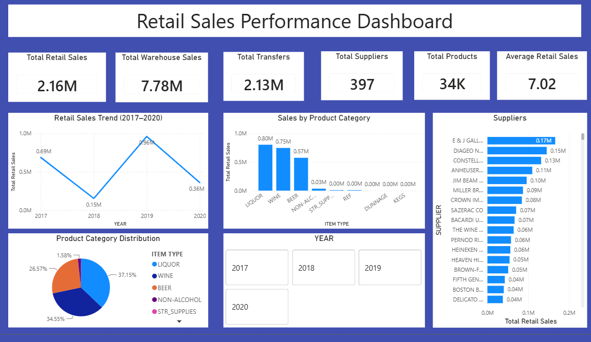

# 🛒 Retail Sales Analysis — SQL & Power BI

## 📌 About the Project

This project focuses on analyzing **307,000+ retail sales records** using **MySQL and Microsoft Power BI** to understand sales performance, product categories, suppliers, warehouse activity, and sales trends.

The project combines SQL-based data analysis with an interactive Power BI dashboard to transform raw retail data into meaningful business insights and management-friendly reporting.

SQL was used to perform data exploration, filtering, aggregation, distinct-value analysis, and business metric calculations. The analyzed data was then visualized through Power BI using KPI cards, charts, and trend analysis.

---

## 🎯 Project Objectives

- Analyze 307,000+ retail sales records
- Understand overall retail sales performance
- Analyze retail and warehouse sales
- Identify sales trends across different years
- Analyze sales by product category
- Understand supplier contribution
- Identify the number of products and suppliers
- Calculate key sales KPIs
- Create an interactive Power BI dashboard
- Convert raw sales data into actionable business insights

---

## 📊 Dataset

The project uses a large retail sales dataset containing **307,000+ records**.

The data contains information related to:

- Retail sales
- Warehouse sales
- Transfers
- Suppliers
- Products
- Item descriptions
- Item types
- Sales year
- Sales month
- Product-level sales performance

The dataset was analyzed using MySQL and the results were visualized in Power BI.

> The raw data is used as the source for the SQL analysis and Power BI report. A separate dataset file is not required in the GitHub repository because the SQL and Power BI files contain the project analysis/reporting workflow.

---

## 🔍 SQL Analysis

MySQL was used to explore and analyze the retail sales dataset.

### SQL operations performed

- Database and table creation
- Data inspection
- Record counting
- Column and table structure analysis
- Missing-value checks
- Distinct supplier analysis
- Distinct product analysis
- Distinct item-type analysis
- Year-range analysis
- Total retail sales calculation
- Total warehouse sales calculation
- Data aggregation
- Filtering and sorting

These queries were used to understand the structure and overall performance of the retail sales data before building the dashboard.

---

## 📈 Power BI Dashboard

The Power BI dashboard provides an interactive overview of retail sales performance.

### 📊 Key KPIs

| KPI | Value |
|---|---:|
| Total Retail Sales | 2.16M |
| Total Warehouse Sales | 7.78M |
| Total Transfers | 2.13M |
| Total Suppliers | 397 |
| Total Products | 34K |
| Average Retail Sales | 7.02 |

---

## 📊 Dashboard Features

### 1. Retail Sales Performance

The dashboard provides a high-level view of retail sales using KPI cards and visualizations.

Key metrics include:

- Total Retail Sales
- Total Warehouse Sales
- Total Transfers
- Total Suppliers
- Total Products
- Average Retail Sales

---

### 2. Retail Sales Trend

A year-wise trend visualization is used to analyze retail sales performance across **2017–2020**.

This helps identify changes in sales performance over time.

---

### 3. Sales by Product Category

The dashboard compares retail sales across different product categories.

Major categories displayed include:

- Liquor
- Wine
- Beer
- Non-Alcoholic Beverages
- Other product categories

This helps identify which product categories contribute most to retail sales.

---

### 4. Supplier Analysis

Supplier-level analysis is used to compare retail sales contribution across suppliers.

The dashboard highlights suppliers with higher retail sales performance and allows stakeholders to compare supplier-level results.

---

## 💡 Business Insights

The dashboard helps answer important business questions such as:

- What is the total retail sales value?
- How much warehouse sales were recorded?
- How do retail sales change across years?
- Which product categories generate the highest retail sales?
- Which suppliers contribute the most to sales?
- How many suppliers and products are present in the dataset?
- What is the average retail sales value?
- How does sales performance vary across different periods?

---

## 📌 Key Findings

Based on the Power BI dashboard:

- Total retail sales are approximately **2.16M**.
- Total warehouse sales are approximately **7.78M**.
- Total transfers are approximately **2.13M**.
- The dataset contains **397 suppliers**.
- The dashboard reports approximately **34K products**.
- Average retail sales are approximately **7.02**.
- Retail sales show variation across the **2017–2020** period.
- Product categories such as **Liquor, Wine, and Beer** contribute significantly to retail sales.
- Supplier-level analysis helps identify high-performing suppliers.

---

## 🛠️ Tools & Technologies

### SQL

- MySQL
- SQL Queries
- Aggregate Functions
- GROUP BY
- DISTINCT
- Filtering
- Sorting
- Data Exploration
- Data Validation

### Power BI

- Power BI Desktop
- KPI Cards
- Line Charts
- Bar Charts
- Data Visualization
- Interactive Reports
- Dashboard Design

---

## 🧠 Skills Demonstrated

- SQL Data Analysis
- MySQL
- Data Exploration
- Data Cleaning & Validation
- Data Aggregation
- KPI Development
- Business Intelligence
- Power BI Dashboard Development
- Data Visualization
- Trend Analysis
- Product Analysis
- Supplier Analysis
- Business Reporting
- Analytical Problem Solving

---

## 📁 Project Structure

```text
MySQL_Retail_Sales_Project/
│
├── README.md
│
├── retail_sales.sql
│
├── Retail-Sales-Analysis.pbix
│
└── images/
    └── retail-sales-dashboard.png

---

## 📁 Project Screenshot


